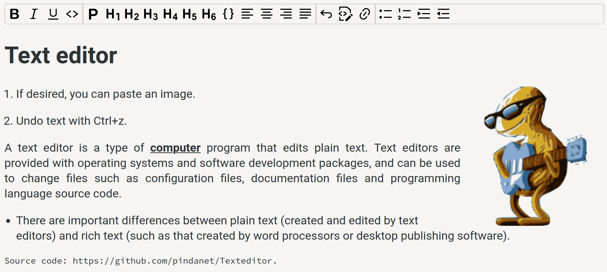

# Texteditor
## HTML WYSIWYG editor
A text editor for HTML pages in JavaScript.

This text editor does not use the execCommand method, but does use the Element contentEditable Property.

Demo op de [Pindanet Github Page](https://pindanet.github.io/Texteditor/).

